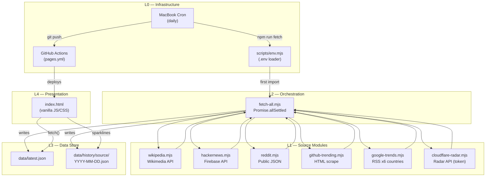

# Web Pulse — Architecture Layer Stack

## Layer Matrix

| Layer | Name | Files | Description |
|-------|------|-------|-------------|
| L4 | Presentation | `index.html` | Single-file static dashboard. Vanilla JS/CSS. Fetches `data/latest.json`, renders 6-tile grid. Light/dark mode. Sparklines for Wikipedia history. |
| L3 | Data Store | `data/latest.json`, `data/history/` | JSON files committed to git. `latest.json` is the live API contract. History is per-source daily snapshots, 30-day retention. |
| L2 | Orchestration | `scripts/fetch-all.mjs` | Runs 6 source fetchers via `Promise.allSettled`. Writes `latest.json` and history snapshots. Prunes history >30 days. |
| L1 | Source Modules | `scripts/sources/*.mjs` | 6 fetch modules. Each exports `default async function` returning `{ source, label, fetched_at, items }`. |
| L0 | Infrastructure | `scripts/env.mjs`, `.github/workflows/pages.yml`, `.env`, MacBook cron | `.env` loader (must import first). GitHub Actions deploys to Pages on push. Daily cron runs fetch+commit+push. |

---

## Architecture Diagram



---

## Source Module Details

| Module | API Type | Auth | Rate Limit Handling | Notes |
|--------|----------|------|---------------------|-------|
| `wikipedia.mjs` | REST (Wikimedia) | None (User-Agent) | 3-date fallback (1-3 days ago) | Filters boring pages (Main_Page, Special:, etc.) |
| `hackernews.mjs` | REST (Firebase) | None | None needed | Parallel item hydration via `Promise.all` for top 25 |
| `reddit.mjs` | Public JSON | None (User-Agent critical) | 429 risk without proper UA | `r/all/top.json?t=hour` |
| `github-trending.mjs` | HTML scrape | None | None | Uses `node-html-parser`. Selectors may break on markup changes. |
| `google-trends.mjs` | RSS feed | None | `Promise.allSettled` across 6 countries | Regex-based XML parsing. Merges by title, multi-country = higher rank. |
| `cloudflare-radar.mjs` | REST (CF API) | Bearer (`CF_RADAR_TOKEN`) | Graceful degradation if no token | Returns `configured: false` with helpful message |

---

## Daily Data Flow Lifecycle

1. MacBook cron fires `npm run fetch`
2. `env.mjs` loads `.env` into `process.env`
3. `fetch-all.mjs` runs 6 sources in parallel via `Promise.allSettled`
4. Each source returns `{ source, label, fetched_at, items }` or throws
5. `Promise.allSettled` captures both fulfilled and rejected
6. Rejected sources get error payloads: `{ source, fetched_at, error, items: [] }`
7. `latest.json` written to `data/`
8. Per-source history snapshot written to `data/history/<source>/YYYY-MM-DD.json`
9. History >30 days pruned by `pruneOldHistory()`
10. Cron does `git add data/ && git commit && git push`
11. GitHub Actions deploys to Pages within ~2 minutes
12. Browser loads `index.html`, fetches `data/latest.json`, renders tiles

---

## Source Module Contract

Every source module must export a default async function returning:

```javascript
{
  source: "source-key",           // kebab-case, matches filename
  label: "Human-readable label",  // displayed in tile header
  fetched_at: new Date().toISOString(),
  items: [
    { rank: 1, title: "...", /* source-specific fields */ },
    // ...
  ]
}
```

Optional fields: `data_date`, `configured`, `message`, `error`

---

## Roadmap (from handoff/)

- **Phase 1**: Deltas and sparklines — extend history, rank deltas, sparklines on all tiles
- **Phase 2**: Cross-source clustering — topics appearing in 2+ sources
- **Phase 3**: New sources — News, YouTube, Spotify, Steam, Twitch, Bluesky
- **Phase 4**: Analysis surface — filters, search, narrative brief
